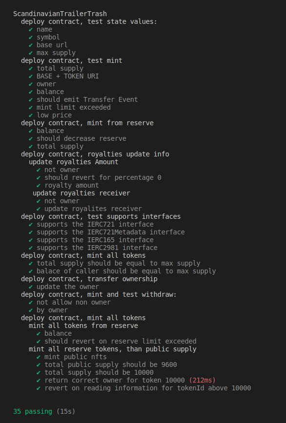

# ERC721 Collection

## Commands available to run

You can run the following commands in the root directory.

### yarn install or yarn

Run `yarn install` or `yarn` to install the dependencies.

### npx hardhat compile

Run `npx hardhat compile` to create artifacts.

### npx hardhat test

Run `npx hardhat test` to execute tests scripts.

## Test Results

The following image shows the test results.

